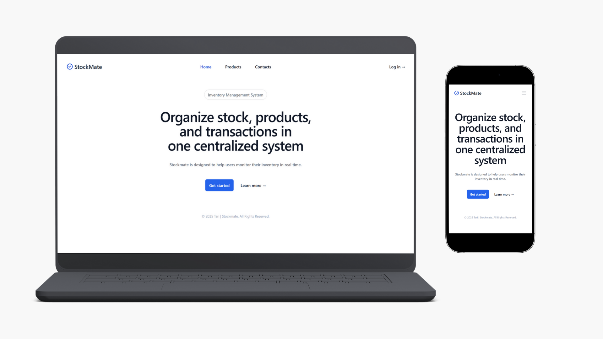

# Stockmate

Stockmate is inventory management system built using Laravel. This web application allow users to manage products, organize categories, oversee partners business, and track transactions. In the future, it will also be integrated as an API for e-commerce platforms. The integration is currently under development.

## Tech Stack

Laravel, Blade, and styled using Tailwind CSS, Alpine.js, and Flowbite.

## Getting Started

-   git clone https://github.com/taripuspitasari/laravel-inventory-app.git
-   cd stockmate
-   composer install
-   npm install
-   cp .env.example .env
-   php artisan key:generate
-   php artisan migrate
-   npm run dev

